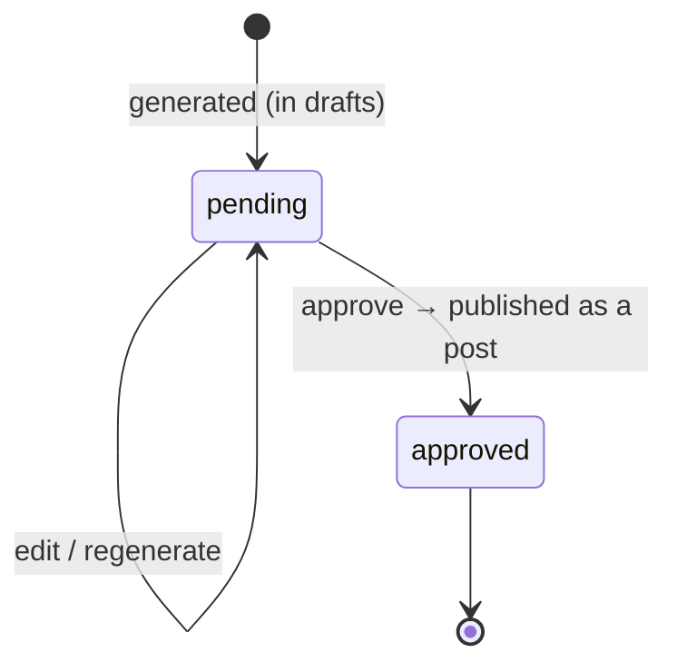

# Series

A **series** is an ordered, multi-part collection of posts on one topic (e.g. a 4-part
"LangChain Deep Dive"). Series can be **generated** from a topic + a spec type, or assembled
manually from existing posts. Readers navigate parts via a "Part N of M" strip and a public
`/series` section.

There are two distinct surfaces — don't confuse them:

| Surface | URL | Who | Purpose |
|---------|-----|-----|---------|
| Public hub | `/series` | Readers | Browse all series that have ≥1 published part |
| Public detail | `/series/{id}` | Readers | One series: description + ordered published parts |
| Admin | `/admin/series` | You | Generate series, see each series' parts (drafts + posts), delete |

---

## The lifecycle (generate → validate → publish)

A generated series doesn't appear on the public `/series` pages until its parts are
**approved**. Generation only produces *drafts* — you validate each one first.

```mermaid
flowchart TD
    A["Admin fills the form:<br/>topic + spec type + parts"] -->|"POST /api/series/generate"| B["Planner (Haiku)<br/>plan_series → outline of N parts"]
    B --> C["Create series row<br/>id = slug(topic)-slug(type)<br/>e.g. langchain-deep-dive"]
    C --> D["HTTP 202 + outline<br/>(returns immediately)"]
    C -. "background, off the event loop" .-> E["For each part:<br/>generate_with_review<br/>Sonnet draft + Haiku review (≤2 tries)<br/>+ web-search sources"]
    E --> F["Insert DRAFT<br/>status = pending<br/>series_id + series_order set"]
    F --> G["/admin/drafts<br/>review · edit · regenerate"]
    G -->|"approve"| H["Copy into posts<br/>series_id / series_order carried over"]
    H --> I["Public /series and /series/&#123;id&#125;<br/>+ 'Part N of M' nav on each post"]

    style F fill:#facc15,stroke:#a16207,color:#000
    style H fill:#34d399,stroke:#047857,color:#000
    style I fill:#818cf8,stroke:#3730a3,color:#000
```



**In words:**
1. You submit a topic + spec type (+ optional part count and guidance) on `/admin/series`.
2. A fast **Haiku planner** turns it into an outline of N distinct parts and the series row is
   created immediately (you get the outline back as HTTP 202).
3. Each part is then generated **in the background** through the normal post pipeline (Sonnet
   write + Haiku "slop" review, capped at 2 attempts, plus web-search sources) and inserted as
   a **pending draft** carrying its `series_id` and `series_order`.
4. You **validate** each draft in `/admin/drafts` — read it, edit, or regenerate with remarks.
5. **Approve** publishes the draft into `posts`, carrying the series assignment across.
6. Once ≥1 part is published, the series shows up on the public **`/series`** hub, gets its own
   **`/series/{id}`** page, and every part post shows the **"Part N of M"** nav strip (whose
   title links back to the series page).

### Draft states



### How do I get from a series to its draft parts?

`/admin/series` lists every series with its parts inline:
- a **draft — review** badge links to `/admin/drafts/{id}` (validate it there), and
- a **published** badge links to the live post at `/blog/{slug}`.

So: `/admin/series` → click the part → land on the draft-review page → approve.
(The public `/series` page only ever shows *published* parts — drafts live in admin.)

---

## Spec types

The "shape" of a series is a spec type from `backend/data/series_types.json`. Each defines the
arc across parts and per-part guidance fed to the planner:

| id | Label | Shape |
|----|-------|-------|
| `deep-dive` | Deep dive | One topic, progressively deeper each part (intro → internals → production) |
| `overview` | Overview / survey | One sub-area per part, similar depth — maps the whole space |
| `tutorial` | Tutorial series | A running project built up part-by-part |

A free-text **guidance** field is always available on top of the chosen type. Add or tune
types by editing `series_types.json` — no Python changes needed.

---

## How to generate a series

**Admin UI** — `/admin/series` → "Generate a series": topic, type, part count (2–8, optional),
extra guidance. Returns the planned outline instantly; parts fill into `/admin/drafts`.

**API**
```bash
curl -X POST http://localhost:8080/api/series/generate \
  -H "Content-Type: application/json" \
  -d '{"topic": "LangChain", "series_type": "deep-dive", "parts": 2,
       "guidance": "focus on practical use"}'
# → 202 { series_id: "langchain-deep-dive", series_title, parts: [...] }
```

**CLI skill** — `/generate-series LangChain deep-dive 2` (see
`.claude/skills/generate-series/SKILL.md`).

> **Cost:** a series ≈ N × a single post (each part: up to 2 Sonnet attempts + a Haiku review
> + a web-search sources call), plus one cheap Haiku planning call. Test with `parts: 2` first.
> See the cost-management section in [architecture.md](architecture.md).

---

## Data model & code map

- **Tables** (`backend/db.py`): `series` (id, title, description, created_at);
  `posts.series_id` / `posts.series_order`; `drafts.series_id` / `drafts.series_order`
  (so the assignment survives approval). No FK enforcement — deleting a series nulls out
  references explicitly.
- **Generation** (`backend/routers/generate_api.py`): `plan_series` (planner), `generate_series`
  (background orchestrator), `SERIES_GENERATION_ATTEMPTS`.
- **API** (`backend/routers/series_api.py`): `GET/POST/DELETE /api/series`,
  `POST /api/series/generate`. Prompts in `backend/data/prompts/series_plan_*`.
- **Public pages** (`backend/main.py`): `GET /series`, `GET /series/{id}` → `series_list.html`,
  `series_detail.html`. Read helpers `get_series_list` / `get_series` / `get_series_siblings`
  in `backend/data/posts.py`.
- **Admin** (`backend/main.py` + `frontend/templates/admin_series.html`): generate form, series
  list with clickable parts, delete.
